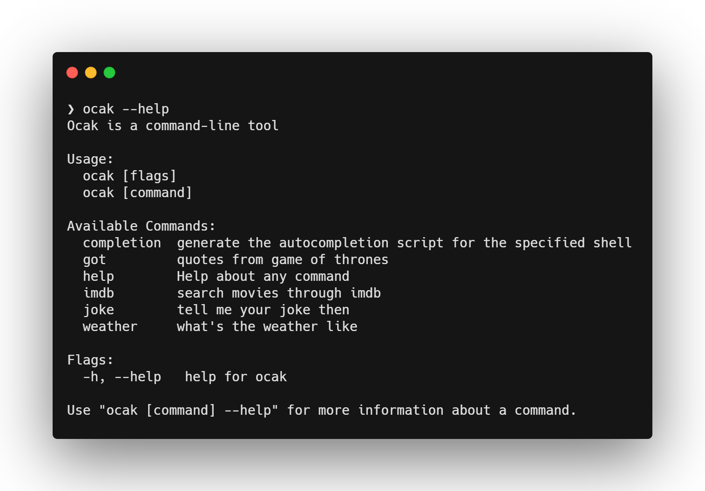

# OCAK 

Special command line application for various purposes. 

## Commands



## HOW TO USE IT?
First you nede to clone the repository
```
> git clone https://github.com/ocakhasan/ocak.git && cd ocak/
```
Then you need to create specify your environment variables to use some of the features of `ocak`
```
GOOGLE_SEARCH_API_KEY=<your-google-search-api-key>
GOOGLE_SEARCH_ENGINE_ID=<your-google-search-engine-id>
OPEN_WEATHER_API_KEY=<your-open-weather-map-api-key>
```

Then you can install the program
```
> go install
```

Then you are good to go.
